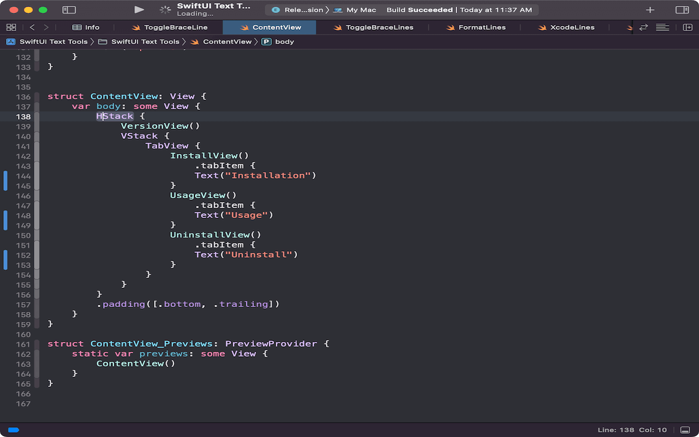

# swiftuitools
Xcode extension for SwiftUI

SwiftUI Text Tools is an Xcode plug-in to manipulate your Swift code.
Currently in version 1.0 the  extension contains tools to maniplutate the commenting or removal of lines with open braces '{'. This is useful when using SwiftUI previews to adjust view while in Preview.

More tools will be added in later versions.

## Preview

### ToggleBrace

### ToggleBraceLines

### RemoveBrace

### RemoveBraceLines

## Installation

There are a couple of ways to install.

1. Download the App directly. 
  <https://github.com/tgunr/swiftuitools/releases/download/v1.0/SwiftUI.Text.Tools.zip>

3. Clone and archive to Mac App by yourself.

## Usage

**After installation, you should open the `SwiftUI Tools Extension.app` once to make the functionality works.**
In Xcode, select text containing an opening brace as shown in the previews.

In the Xcode menu click **[Editor] -> [SwiftUI Tools] -> [Tool]** 

Select one of:

**[Toggle Brace]** 

**[Toggle Brace Lines]** 

**[Remove Brace]** 

**[Remove Brace Lines]** 

You can also create a hot-key in **[Xcode] -> [Preferences..] -> [Key Bindings]**
Suggested bindings are:

**[Toggle Brace]** <kbd>F1</kbd>

**[Toggle Brace Lines]** <kbd>F2</kbd> 

**[Remove Brace]** <kbd>Option</kbd> + <kbd>F1</kbd>

**[Remove Brace Lines]** <kbd>Option</kbd> + <kbd>F2</kbd>

## TroubleShooting

Check [System Preferences] -> [Extensions] -> [Xcode Source Editor] -> [SwiftUI Text Tools] is checked. 

## Contribution
This extensions use code from <https://github.com/Jintin/Swimat> for parsing.

## Contributing

Bug reports and pull requests are welcome on GitHub at <https://github.com/tgunr/swiftuitools>.

## License

The module is available as open source under the terms of the [MIT License](http://opensource.org/licenses/MIT).
